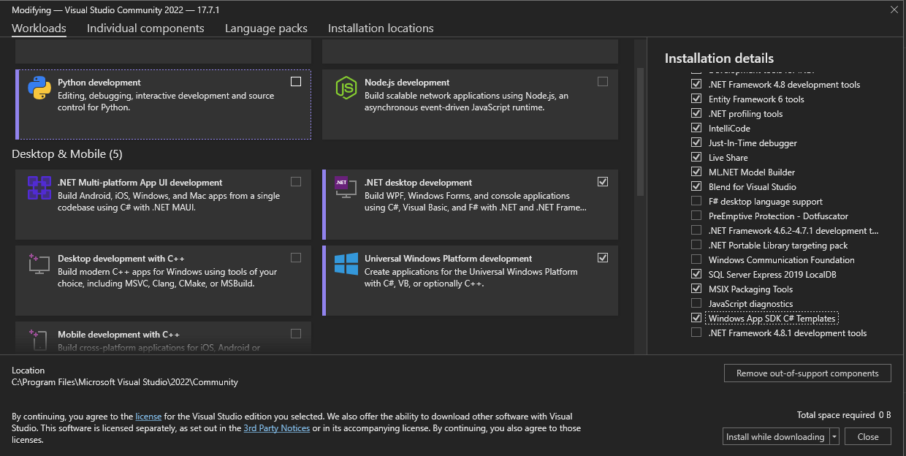

# REZ Menu App


REZ is a simple Restaurant Menu Application for a fictional restaurant to provide an easy experience to order food from the table with autonomy.
It makes it easier to costumers and waiters to keep track of bills and order items, as well as having a clear view of what the restaurant has to offer.

This is the final group project for discipline INF0999 (Final Project) of the training course in Microsoft technologies at the Institute of Computing at the State University of Campinas (UNICAMP).

|This Project is still under construction|
|----------------------------------------|

### Contributors

<a href="https://github.com/lknknm/REZ-menu-app/graphs/contributors">
  
  
  
  
</a>

## Getting Started

These instructions will get you a copy of the project up and running on your local machine for development and testing purposes. See deployment for notes on how to deploy the project on a live system.

### Figma
This project uses [Figma](https://www.figma.com/) for UX/UI decisions and Front-End integration.
You can see the Figma Project here: [REZ-Figma](https://www.figma.com/file/q4bRKQlg10WCewYgHmsdBE/REZ-menu-app?type=design&node-id=5-2&mode=design&t=4dnfC1gUSZ6n4NAY-0).
Additionally, since this project uses [WinUI 3.0](https://github.com/microsoft/microsoft-ui-xaml) as user interface layer, you can also access their Figma component library [here](https://www.figma.com/file/yCWdGgBeP6mkBBlS2IDaHG/Windows-UI-3-(Community)?type=design&node-id=238-0&mode=design&t=wUs0QsJ21QrmX9sj-0).

### How to Build
This project uses .NET Framework with WinUI as User Interface Layer (Windows only). To be able to build this project properly, it is necessary to have [Visual Studio 2022 17.1 and later](https://visualstudio.microsoft.com/pt-br/) installed and running. 

1. After setting up Visual Studio, make sure to double check the workloads you have installed under `Visual Studio Installer`. For this project it is necessary to have the `.NET Desktop Development` workload installed, as well as the [`Tools for Windows App SDK`](https://learn.microsoft.com/en-us/windows/apps/windows-app-sdk/set-up-your-development-environment?tabs=cs-vs-community%2Ccpp-vs-community%2Cvs-2022-17-1-a%2Cvs-2022-17-1-b) and `Windows App SDK C# Templates`.



2. For this stage of the project, is also important to install the NuGet package [Newtonsoft.Json](https://www.nuget.org/packages/Newtonsoft.Json/13.0.3?_src=template)

3. Download the source code of this project by forking (if you want to work on your own features) or by cloning this repository.
```bash
git clone https://github.com/lknknm/REZ-menu-app.git
```

4. On Visual Studio go to `File > Open > Open Project/Solution` and select `./REZ/REZ.sln` to open the project.

5. Now you can Build Solution (Ctrl+B) and execute it normaly with Visual Studio debug features.

# License

REZ - Easy Restaurant App is licensed and distributed under the 3-Clause BSD License. See [License](./LICENSE.md). Keep in mind this is a non-profit, student project. 
