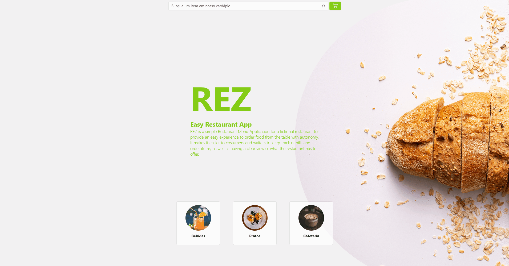

# REZ Menu App

REZ is a simple Restaurant Menu Application for a fictional restaurant to provide an easy experience to order food from the table with autonomy.
It makes it easier to costumers and waiters to keep track of bills and order items, as well as having a clear view of what the restaurant has to offer.

This is the final group project for discipline INF0999 (Final Project) of the training course in Microsoft technologies at the Institute of Computing at the State University of Campinas (UNICAMP).

|This Project is still under construction|
|----------------------------------------|

### Contributors

## Getting Started

These instructions will get you a copy of the project up and running on your local machine for development and testing purposes. See deployment for notes on how to deploy the project on a live system.

### Figma
This project uses [Figma](https://www.figma.com/) for UX/UI decisions and Front-End integration.
You can see the Figma Project here: [REZ-Figma](https://www.figma.com/file/q4bRKQlg10WCewYgHmsdBE/REZ-menu-app?type=design&node-id=5-2&mode=design&t=4dnfC1gUSZ6n4NAY-0).
Additionally, since this project uses [WinUI 3.0](https://github.com/microsoft/microsoft-ui-xaml) as user interface layer, you can also access their Figma component library [here](https://www.figma.com/file/yCWdGgBeP6mkBBlS2IDaHG/Windows-UI-3-(Community)?type=design&node-id=238-0&mode=design&t=wUs0QsJ21QrmX9sj-0).

### Documentation
- To see how to build the project, please take a look at the developer documentation and follow the [Build Manual](./doc/dev/BUILD.md). 
- To see how we style our code, please refer to the [Code Style Guide](./doc/dev/styleguide.md)
- To follow the criteria and ideation development process, please check [Criteria Document](./doc/dev/CRITERIA_pt.md) and [UX_Criteria Document](./doc/dev/UX_CRITERIA_pt.md) in the [developer documentation](./doc/dev/) (Portuguese).

# License

REZ - Easy Restaurant App is licensed and distributed under the 3-Clause BSD License. See [License](./LICENSE.md). Keep in mind this is a non-profit, student project. 
