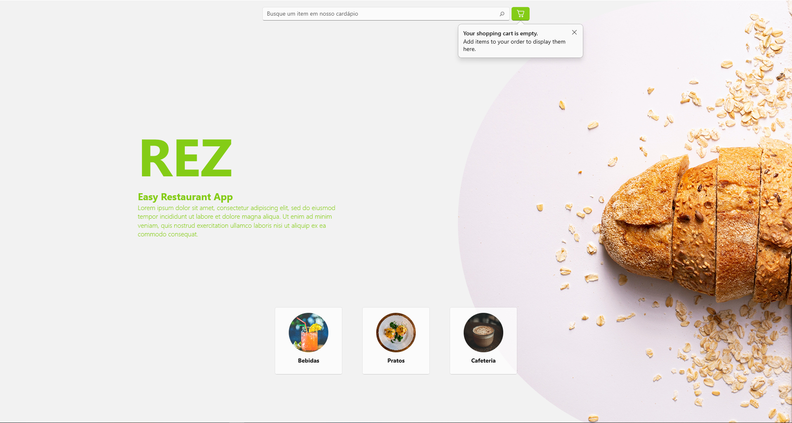

# REZ Menu App



REZ is a simple Restaurant Menu Application for a fictional restaurant to provide an easy experience to order food from the table with autonomy.
It makes it easier to costumers and waiters to keep track of bills and order items, as well as having a clear view of what the restaurant has to offer.

This is the final group project for discipline INF0999 (Final Project) of the training course in Microsoft technologies at the Institute of Computing at the State University of Campinas (UNICAMP).

|This Project is still under construction|
|----------------------------------------|

### Contributors

<a href="https://github.com/lknknm/REZ-menu-app/graphs/contributors">
  
  
  
</a>

## Getting Started

These instructions will get you a copy of the project up and running on your local machine for development and testing purposes. See deployment for notes on how to deploy the project on a live system.

### Prerequisites

The things you need before installing the software.

* You need this
* And you need this
* Oh, and don't forget this!

### Installation

A step by step guide that will tell you how to get the development environment up and running.

```
$ First step
$ Another step
$ Final step
```

## Usage

A few examples of useful commands and/or tasks.

```
$ First example
$ Second example
$ And keep this in mind
```

## Deployment

Additional notes on how to deploy this on a live or release system. Explaining the most important branches and how to update the database (if anything special).

### Server

* Live:
* Release:
* Development:

### Branches

* Master:
* Feature:
* Bugfix:
* etc...

### Usage

* Description and images of how to use the application.

## Additional Documentation and Acknowledgments

* Project folder on server:
