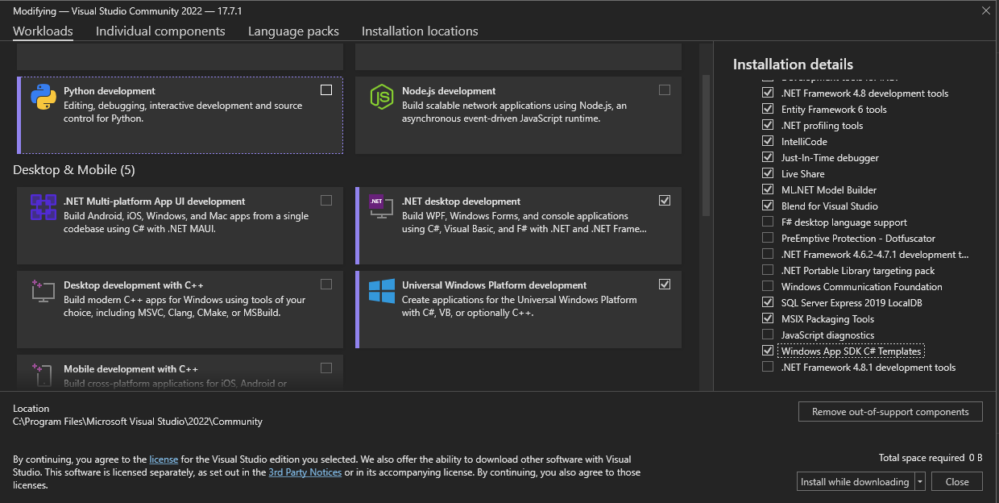

### How to Build
REZ uses .NET Framework with WinUI as User Interface Layer (Windows only) and Visual Studio as build system. To be able to build this project properly, it is necessary to have [Visual Studio 2022 17.1 and later](https://visualstudio.microsoft.com/pt-br/) installed and running. 

1. After setting up Visual Studio, make sure to check the workloads you have installed under `Visual Studio Installer`. 
For this project it is necessary to have the `.NET Desktop Development` workload installed, as well as the [`Tools for Windows App SDK`](https://learn.microsoft.com/en-us/windows/apps/windows-app-sdk/set-up-your-development-environment?tabs=cs-vs-community%2Ccpp-vs-community%2Cvs-2022-17-1-a%2Cvs-2022-17-1-b) and `Windows App SDK C# Templates`.



2. For this stage of the project, is also important to install the NuGet package [Newtonsoft.Json](https://www.nuget.org/packages/Newtonsoft.Json/13.0.3?_src=template) if you want to run it properly with the Json product catalog.

3. Download the source code of this project by forking (if you want to work on your own features) or by cloning this repository.
```bash
git clone https://github.com/lknknm/REZ-menu-app.git
```

4. On Visual Studio go to `File > Open > Open Project/Solution` and select `./REZ/REZ.sln` to open the project.

5. Now you can Build Solution (Ctrl+B) and execute it normaly with Visual Studio debug features.