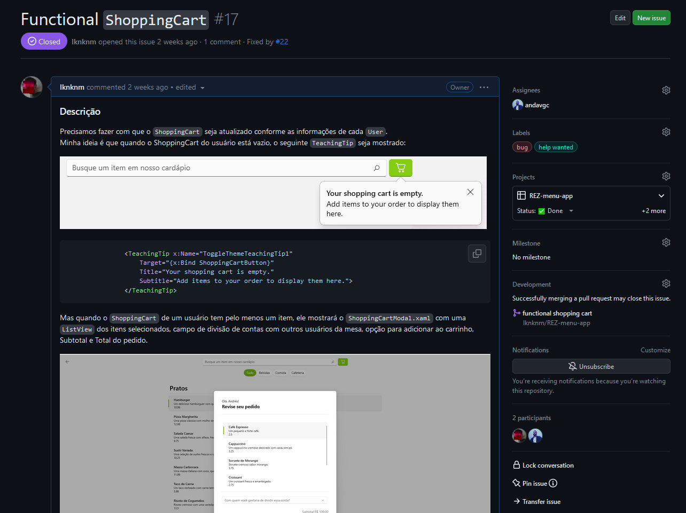
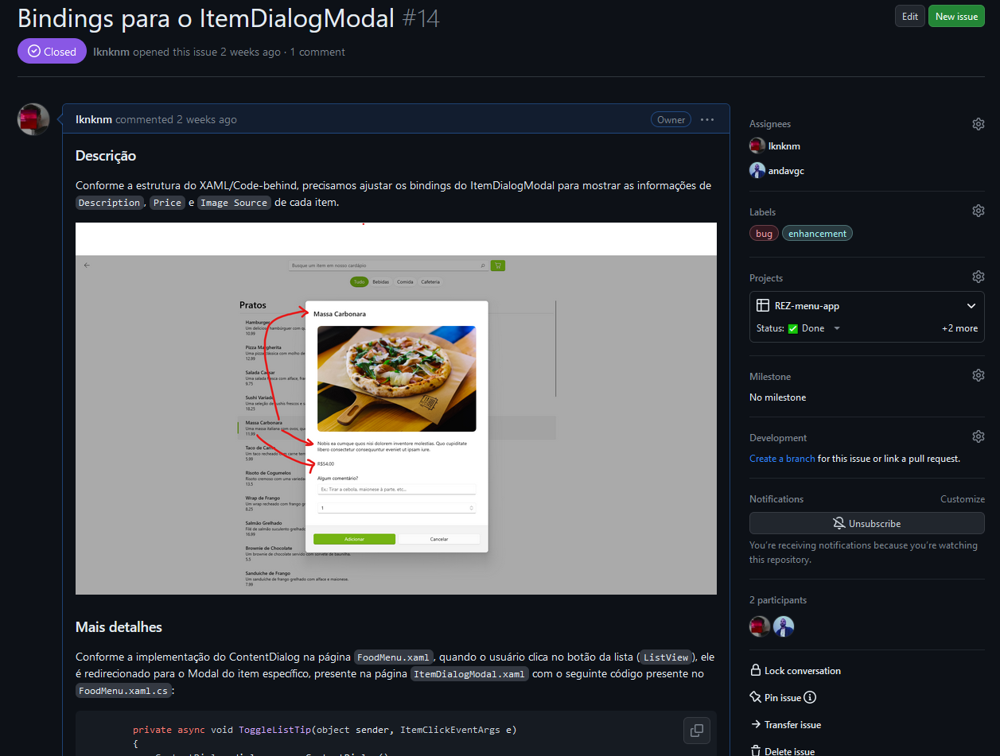
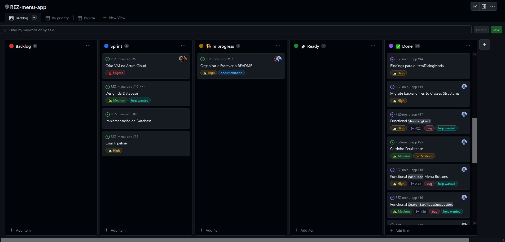
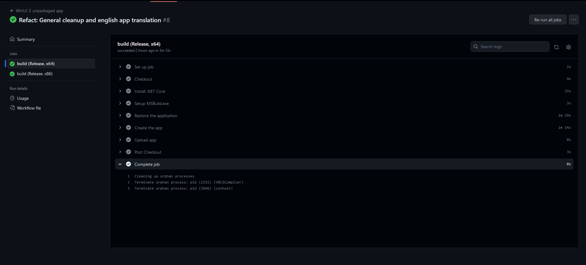
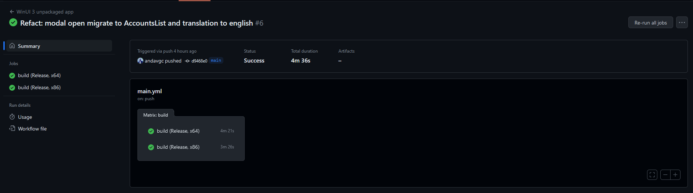
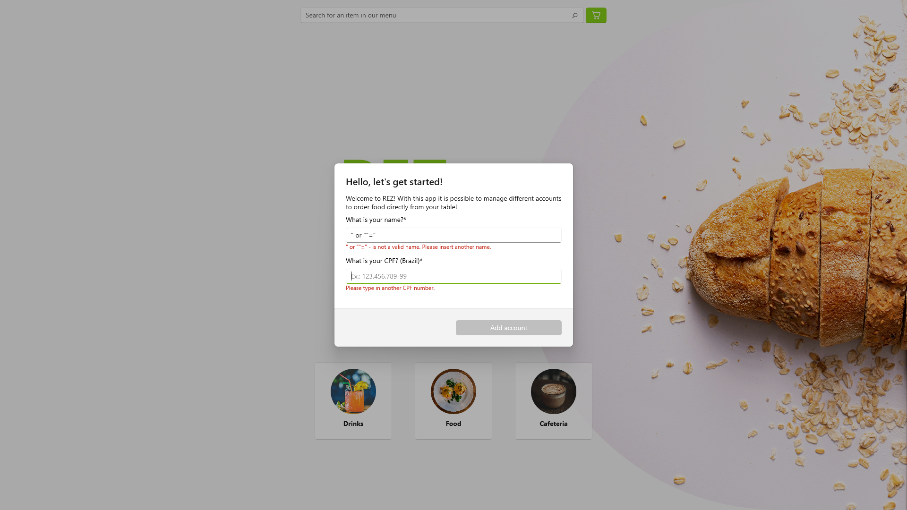
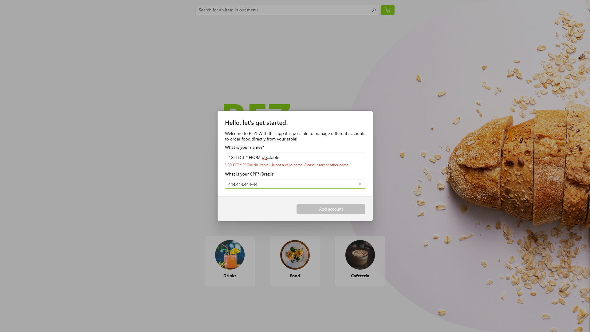

# REZ Development Report (INF-0999)
Provided this is the Final Project of the training course in Microsoft technologies at the Institute of Computing at the State University of Campinas (UNICAMP), it is important that the students follow some base criteria about each subject taught during the course. For that reason, the following topics were considered during development:

- C# Programming Language and known software architecture patterns;
- Code versioning;
- Hosting;
- Project Management;
- User Experience;
- User Interface Programming;
- Safe Programming;

## Programming and Architecture Pattern

#### Architecture pattern:
This is a .NET Core 7.0 program that uses WinUI 3.0 as User Interface Layer. Due to WinUI's nature, this app uses the MVVM pattern. The structure of this project for the MVVM pattern goes as follows:

- `*.xaml` files as View, which contains the bindings to the corresponding code-behind, Front-End and in-line component  styling;
- `*.xaml.cs` (code-behind) files as ViewModel, which will handle the logic behind bindings through `DataContext`, as well as Validation and coordination between View and Model;
- `*xaml.cs` and `*.cs` files as Model, which will coordinate the Event State Change using interfaces such as `INotifyPropertyChanged` or `INotifyCollectionChanged`. The Model will also handle and provide the Data fed to the application passing it to the ViewModel, which in turn will pass it to the View.

#### Code Style:
We made a code style guide for the development process. This helped us to maintain the code readable and understandable for any collaborator. Since this is a student project, we are also open to improvements and suggestions.

- For more information: [REZ-CodeStyle Guide](./styleguide.md).

#### Build
To build the software, there is a list of dependencies to install and configure inside Visual Studio. We made a quick-start guide for this:
- For more information: [REZ Build Quick-Start Guide](BUILD.md). 

## Code Versioning
For code versioning we used the Git + GitHub remote repository workflow. Branch names are specific for a feature (or set of features) that the developers are currently working, so Pull Requests can be concise and easy to read. They can also be attached to an specific issue so both are closed after a merge.

For this project we have been using the [Shared Repository Model](https://docs.github.com/en/pull-requests/collaborating-with-pull-requests/getting-started/about-collaborative-development-models#shared-repository-model), in which all collaborators are granted access to the single shared repository. Each branch is created to meet an specific issue requirements so we can merge the code via a PR with code review.

Branch names can be specified using a simple pattern like:
```
add_functional_shoppingcart
fix_menu_images
doc_devreport
```

The commit message standards we are using may follow (but not only) these rules:
```
* feat – a new feature is introduced with the changes
* fix – a bug fix has occurred
* chore – changes that do not relate to a fix or feature and don't modify src or test files (for example updating dependencies)
* refactor – refactored code that neither fixes a bug nor adds a feature
* docs – updates to documentation such as a the README or other markdown files
* style – changes that do not affect the meaning of the code, likely related to code formatting such as white-space, missing semi-colons, and so on.
* test – including new or correcting previous tests
* perf – performance improvements
* ci – continuous integration related
* build – changes that affect the build system or external dependencies
* revert – reverts a previous commit
```
On the GitHub repository, we have been opening and tracking issues for each feature or bugfix. The issues have a simple template for messages, in which a `Description` and `Further Information` should be provided. Issues can be written in English or Portuguese.



- [GitHub Repository](https://github.com/lknknm/REZ-menu-app);
- You can see Open and Closed Issues [here](https://github.com/lknknm/REZ-menu-app/issues);
- You can see the Open and Merged Pull Requests with discussion [here](https://github.com/lknknm/REZ-menu-app/pulls).

## Project Management
We managed the project with GitHub Projects by applying the `Agile/Scrum` methodology. This way we can track issues, assign them to each member of the project group and also track the development status. 

The `Agile/Scrum` methodology was used so the group could discuss the current open issues, understand each problem together and organize new sprints to solve them. Features or bugfixes could be suggested by any member of the group (in an ideal case, we could also include users feedback), as long as they provide clear information about the problems they are encountering during the development process.

After tracking each issue and organizing them by `Priority`, we add them to the Backlog, assign them to a group member to solve, and track the status during the Sprint. 





- You can see the GitHub Projects page with the current development status [here](https://github.com/users/lknknm/projects/1/views/1).
- You can see Open and Closed Issues [here](https://github.com/lknknm/REZ-menu-app/issues);
- You can see the Open and Merged Pull Requests with discussion [here](https://github.com/lknknm/REZ-menu-app/pulls).

## Hosting
Since this application is a desktop/tablet application that will be deployed for Surface and other Windows tablet devices, hosting it isn't necessary. It is also worth mentioning that this software is designed for a specific form-factor and screen resolution of `1920x1080`, so the experience could be as fast, fluid and simple as possible.

In this stage, unfortunately, database Hosting was not possible due to Azure subscription limitations. For this reason we used a mock database Json file as part of Model design and that would feed the products catalog to our application.

## Continuous Integration and Testing
We deployed a very simple pipeline for testing — that can also be scalable and improved further — using [GitHub Actions](https://github.com/features/actions).
It will simply build the Unpackaged WinUI 3.0 application with given dependencies and specified nuget packages for each commit and PR. This way we can start testing if the software is correctly building for any Windows platform while commiting changes and submitting PRs. 




- The pipeline was configured by setting up the workflow using GitHub Actions following the Microsoft Documentation: [Set up continuous integration for your WinUI 3 app](https://learn.microsoft.com/en-us/windows/apps/package-and-deploy/ci-for-winui3?pivots=winui3-unpackaged-csharp).
- You can see the `main.yaml` file for CI Testing [here](https://github.com/lknknm/REZ-menu-app/blob/main/.github/workflows/main.yml).


## User Experience
#### Project ideation
To be able to better understand User Experience decisions yet to be made for the application, we took a step back and evaluated the project criteria we needed for it to be functional and visually clean/engaging, as well as possible problems we could come accross during the development process.

We started thinking about how the user flow would look like, how orders would be took and handled and what visual queues would be displayed.

During this initial step, there was no programming involved, only the general ideas and concepts we would like to implement.
We then developed the [Ideation Criteria (Portuguese)](/doc/dev/CRITERIA_pt.md) and [User Experience Criteria (Portuguese)](./UX_CRITERIA_pt.md).

#### Figma

After getting the ideation phase down, we then moved on to templating the project using [Figma](https://www.figma.com/) for UX/UI decisions and Front-End integration.
You can see the Figma Project here: [REZ-Figma](https://www.figma.com/file/q4bRKQlg10WCewYgHmsdBE/REZ-menu-app?type=design&node-id=5-2&mode=design&t=4dnfC1gUSZ6n4NAY-0).
Additionally, since this project uses [WinUI 3.0](https://github.com/microsoft/microsoft-ui-xaml) as user interface layer, you can also access their Figma component library [here](https://www.figma.com/file/yCWdGgBeP6mkBBlS2IDaHG/Windows-UI-3-(Community)?type=design&node-id=238-0&mode=design&t=wUs0QsJ21QrmX9sj-0).
### User Interface Programming
We decided to implement [WinUI 3.0](https://github.com/microsoft/microsoft-ui-xaml) as User Interface Layer due to its easiness of use and quick results for a clean, engaging and gorgeous UI. Since the due dates of the project are short, we decided to use its components library to speed up the process of developing a good looking UI that could engage the user, as well as handle animation, navigation flow, pages and other features. 

To understand WinUI components, behaviors and code, we used the [WinUI 3.0 Gallery](https://github.com/microsoft/WinUI-Gallery) app to navigate throught the whole library. With this App we could get snippets of code with live examples and translate them to the results we wanted to achieve in our Figma Template.

The overall process was straightforward with few difficulties along the way regarding the understanding of the WinUI components behavior and XAML/Code-behind intricacies. Their Figma components library is very close to what they offer inside the WinUI Gallery application, so the "translation" between the two was seamless, besides some few limitations regarding XAML development using their current libraries.

## Safe Programming
To avoid Injection Attacks through inputs of this application, we implemented a basic input validation layer to forms. This layer of protection can prevent SQL injection attacks to a Database connected to the ViewModel.

Unexpected inputs will block the `Send` buttons as well as not be accepted by the Back-End. It is important to mention, though, that if a more robust Back-End/Model is to be implemented, potentially malitious requests should also be rejected by the Back-End in `Model` code.





An input validation example like the above can be seen in the following snippet of code in [AddAccountModal.xaml.cs](https://github.com/lknknm/REZ-menu-app/blob/901ef79076684f79024a613984b2fadb457f3ea4/REZ/AddAccountModal.xaml.cs#L42-L190).

From the application standpoint, it is also worth mentioning that applications built with C#/WinUI will specifically protect the users and clients against Heap/Buffer overflow attacks (both intentional and unintentional) due to a certain degree of memory safety present in the language. Since many higher-level languages like C#, Python and Java are designed to be memory safe and tested to that extent, this project makes use of C#'s handling of memory safety.
